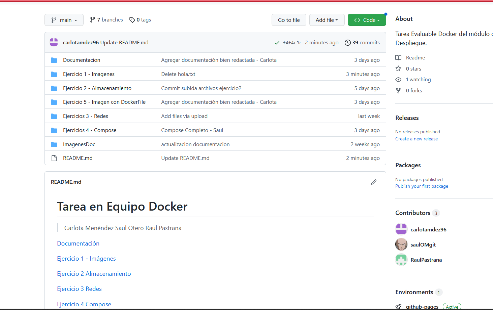

# TAREA DOCKER

> Carlota Menéndez Álvarez
>
> Saúl Otero Melchor
>
> Raúl Pastrana

[TOC]

## Organigrama

## Organización Tareas

El proyecto se inició el día 1 de Febrero. Inicialmente se ha dispuesto el proyecto de la siguiente manera

| Carlota Menéndez               | Saúl Otero            | Raúl Pastrana                   |
| ------------------------------ | --------------------- | ------------------------------- |
| Imágenes con DockerFile (Ej.5) | Redes (Ej.3)          | Imágenes (Ej.1)                 |
| Documentación                  | Docker Compose (Ej.4) | Almacenamiento Portainer (Ej.2) |

Esta sería la disposición de la realización del proyecto de Docker a realizar en clase. La previsión para realizar este trabajo en total serían:  10 horas. Estas horas hacen referencia a las clases de Despliegue que hay entre el 1 de Febrero al 13 de Febrero que es el último día de la realización de la tarea.

## Daily

### Miércoles 1/02

El primer día de la tarea el cuál será importante para hacer la asignación de tareas, explicar el proyecto y crear repositorio. Esta clase irá desde las 9:30 a las 11:15

**10:00-10:30**

- [x] Lectura de las instrucciones del proyecto
- [x] Configuración en grupo del repositorio de git
- [x] Asignación de tareas globales para cada miembro del grupo

**10:30-11:15**

- [x] Planificación individual de cada ejercicio correspondiente
- [x] Lectura de los ejercicios correspondientes a cada miembro del grupo
- [x] Búsqueda de la teoría de apoyo
- [x] Creación de las ramas
- [x] Invitación a colaborar en GitHub a los miembros del grupo
- [x] Creación de los directorios 
- [x] Pruebas de Pull Request
- [x] Comienzo de cada Ejercicio

*Imágenes Destacadas del primer dia*

Creación de las Ramas:

Invitación desde GitHub a colaborar con Saúl y Raúl:

### Viernes 3/02

Segundo día de la tarea, este día  hay dos horas de clase: de 8:30-10:20. En este día todos comenzaremos los ejercicios correspondientes

| Carlota Menéndez               | Saúl Otero   | Raúl Pastrana  |
| ------------------------------ | ------------ | -------------- |
| Imagenes con DockerFile (Ej.5) | Redes (Ej.3) | Imágenes(Ej.1) |

**8:30- 10:20**

- [x] Ejercicio 5 Docker File (Terminado) - Carlota
- [x] Ejercicio 3 Redes (Terminado) - Saúl
- [x] Ejercicio 1 Imágenes Primera Parte - Raúl

Tras finalizar este día se cambió la asignación del ejercicio 2 a Carlota, ya que ya había finalizado la tarea asignada. Además al finalizar cada ejercicio, cada miembro, subió la parte correspondiente a GitHub y Carlota, la jefa del proyecto aprobó los diferentes Pull Request. 

### Lunes 6/02

Tercer día, este día sólo habrá una hora de clase de 13:35-14:30. Tareas a realizar

| Carlota Menéndez                      | Saúl Otero                      | Raúl Pastrana                                   |
| ------------------------------------- | ------------------------------- | ----------------------------------------------- |
| Lectura y preparación del Ejercicio 2 | Comienza el Ejercicio 4 Compose | Comienza la Parte 2 del Ejercicio 1 de Imágenes |

Al finalizar la hora solo se pudo avanzar un poco en cada ejercicio pero no se pudo terminar

**13:35-14:30**

- [x] Preparación del Ejercicio 2 Almacenamiento - Carlota
- [ ] Ejercicio 4 Compose - Saúl
- [ ] Ejercicio 1 Imágenes Parte 2 - Raúl

### Miércoles 8/02

Cuarto día con las tareas asignadas, este día tendremos clase de 9:35 a 11:15. Continuaremos con las tareas que el día anterior no se pudo terminar.

| Carlota Menéndez                       | Saúl Otero                 | Raúl Pastrana                |
| -------------------------------------- | -------------------------- | ---------------------------- |
| Realización Ejercicio 2 Almacenamiento | Ejercicio 4 Docker Compose | Ejercicio 1 Imágenes parte 2 |

*Notas:* Raúl Pastrana lleva retraso con su Ejercicio, le ha resultado muy largo dado a una mala interpretación del mismo. Ha pedido ayuda y se le ha explicado que lo estaba interpretando mal. Al finalizar la hora le quedaban todas las capturas obligatorias que pedía el ejercicio, ya que no había leído esa parte.

En el ejercicio 4 de Docker Compose el cuál esta realizando Saúl tiene dificultades, le salen demasiados fallos y busca soluciones posibles y documentación por internet.

**9:35-11:15**

- [x] Ejercicio 2 Almacenamiento (Terminado) - Carlota
- [ ] Ejercicio 4 Docker Compose (No terminado) - Saúl
- [ ] Ejercicio 1 Imágenes (No terminado) - Raúl

### Viernes 10/02

Quinto día de la realización de la tarea, este día tendremos clase de 8:30-10:20. He intentaremos terminar las tareas asignadas a cada uno, ya que es el penúltimo día que se dedicará a la realización de esta tarea.

| Carlota Menéndez       | Saúl Otero                 | Raúl Pastrana        |
| ---------------------- | -------------------------- | -------------------- |
| Realizar documentación | Ejercicio 4 Docker Compose | Ejercicio 1 Imágenes |

*Notas Importantes*

A Raúl Pastrana se le ha **estropeado** el ordenador donde tenía su ejercicio documentado y no tenía copia de seguridad ni lo había subido a GitHub todavía, porque no lo había terminado. En consecuencia va a tener que volver a empezar el ejercicio 1 de Imágenes.

Saúl ha seguido con las dificultades para la realización del Ejercicio de Docker Compose, finalmente se ha llegado a un acuerdo con el resto de la clase que había estado teniendo problemas con este ejercicio también y lo han terminado resolviendo todos igual y de una manera más sencilla ya que el problema inicial no se encontraba solución.

Dado que Saúl ya ha terminado su tarea asignada, ayuda a Pastrana a finalizar el Ejercicio 1 de Imágenes.

**8:30-10:20**

- [x] Redactar fichero de Documentación (Terminado) - Carlota
- [x] Ejercicio 4 Docker Compose (Terminado)  - Saúl
- [ ] Ejercicio 1 Imágenes (No terminado) - Raúl y Saúl
- [x] Modificación fichero Readme con enlaces (Terminado) -Carlota

### Lunes 13/02

Sexto día de la tarea y **último** , en esta ocasión solo tendremos una hora para finalizar, para perfeccionar el trabajo y entregarlo ese mismo día. La clase irá de 13:35-14:30.

| Carlota Menéndez                                     | Saúl Otero           | Raúl Pastrana        |
| ---------------------------------------------------- | -------------------- | -------------------- |
| Finalizar la documentación y redactar pdf de entrega | Ejercicio 1 Imágenes | Ejercicio 1 Imágenes |

**13:35-14:30**

- [x] Finalizar documentación (Terminado) - Carlota
- [x] Ejercicio 1 Imágenes   - Raúl y Saúl
- [x] Redactar PDF de la entrega (Terminado) - Carlota
- [x] Subida del documento a las aulas Virtuales

## **Resultado Final**

**Opiniones de trabajo en Equipo**

El trabajo inicialmente había sido repartido un poco a ojo por así decirlo, por lo que hubo problemas más adelante con el reparto, ya que hubo miembros que terminaban primero que otros. Creo que para preparar bien cada apartado con 2 horas de clase daba tiempo a leer la teoria bien, mirar ejercicios anteriores y realizar el ejercicio. 

La mayor dificultar ha sido el ejericicio de Docker compose, y realizar el ejercicio 1 de imagenes dos veces por la avería del ordenador de Raúl.

Valoraré el trabajo en equipo con un 6, ya que ha habido situaciones en las que se ha retrasado el trabajo colectivo.

Lo mejor del trabajo en equipo ha sido poder ayudarnos entre nosotros y poder realizar cada uno una tarea, aunque todos hemos visto que han hecho el resto de los miembros del equipo.

