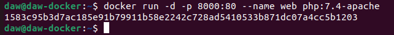

## Ejericios Docker Imágenes
> Raúl Pastrana Cobo

### Servidor Web

1º Arrancamos un contenedor que ejecute una instancia de la imagen php:7.4-apache , que se
llame web y que sea accesible desde un navegador en el puerto 8000.

```sh

docker run -d -p 8000:80 --name web php:7.4-apache

```



2º Colocamos en el directorio raíz del servicio web ( /var/www/html ) un sitio web donde figure el
nombre de los componentes del grupo.

```sh

nano nombreComponentes.html

```


3º Colocamos en ese mismo directorio raíz un archivo llamado mes.php que muestre el nombre
del mes actual. 

```sh

nano mes.php

```


4º La salida del script en el navegador


5º Paramos y borramos el contenedor

```sh

docker stop web

docker rm web

```


Pantallazo que desde el navegador muestre el fichero index.html .


Pantallazo que desde un navegador muestre la salida del script mes.php .


Pantallazo donde se vea el tamaño del contenedor web después de crear los dos ficheros.


### Servidor de base de datos 

1º Arrancamos un contenedor que se llame bbdd y que ejecute una instancia de la imagen
mariadb para que sea accesible desde el puerto 3306.

Antes de arrancarlo visitar la página del contenedor en Docker Hub y establecer las variables
de entorno necesarias para que:
* La contraseña de root sea root . 
* Crear una base de datos automáticamente al arrancar que se llame prueba . 
* Crear el usuario invitado con la contraseña invitado.

```sh

docker run -d -p 3306:80 --name
bbdd --env MARIADB_USER=invitado --env MARIADB_PASSWORD=invitado --env MARIADB_ROOT_PASSWORD=root --env MARIADB_DATABASE=prueba mariadb

```


* Pantallazo donde desde un cliente de base de datos (instalado en tu ordenador) se pueda 
observar que hemos podido conectarnos al servidor de base de datos con el usuario creado
y que se ha creado la base de datos prueba ( show databases ). El acceso se debe realizar
desde el ordenador que tenéis instalado docker, no hay que acceder desde dentro del
contenedor, es decir, no usar docker exec .


* Pantallazo donde se comprueba que no se puede borrar la imagen mariadb mientras el 
contenedor bbdd está creado.


