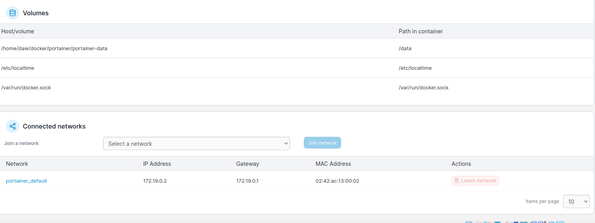

# Ejercicio 2 Almacenamiento - Portainer

> Carlota Menéndez Álvarez

[TOC]


## Instalación Portainer

Inicialmente deberé instalar en mi maquina virtual el docker compose:

```sh
sudo apt install docker-compose
```

Una vez realizado este paso deberemos crear el directorio donde se alojará y editar este fichero.


El fichero contendrá lo siguiente:


**Ponemos en marcha el contenedor usando Docker Compose**

```sh
docker-compose up -p
```


En el navegador accedemos al servicio Portainer que tenemos en ejecucion en Docker:


**Operaciones sobre contenedores**

Situación actual de mi máquina


- Muestro los contenedores que tengo


Borro un contenedor:


- Muestro las redes que tengo


Operación de borrado de una red:


Muestro los contenedores que tienen una red concreta:


- Muestro los volumenes

  

  Creo un volumen nuevo:

  

  Muestro los volumenes que tiene un contenedor concreto, el de portainer en este caso:

  


