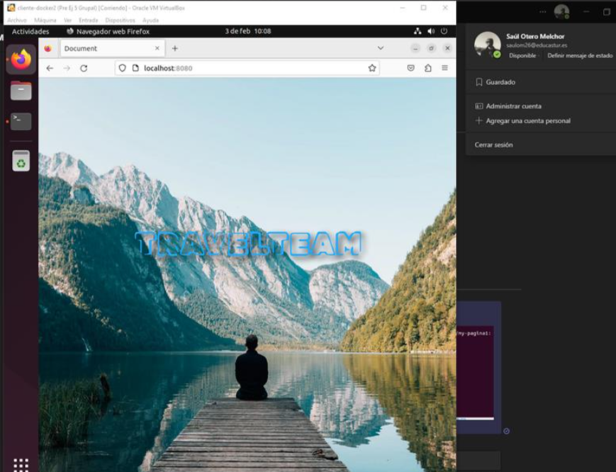

# Ejercicio 5 - Imagen con DockerFile

> Carlota Menéndez Álvarez

[TOC]


**La finalización de este apartado es la creación de una imagen con un servidor web que sirva un sitio web.**

Especificaciones:

Basar la imagen en nginx o apache

Desplegar una plantilla, o un trabajo de clase, que tenga al menos, un index.html y una carpeta con estilos, imagenes, etc.

### Pasos Principales

1. Creación del directorio de trabajo

   

2. Creación del contenido HTML con imagenes y estilos

   

3. Crear el fichero **DockerFile**

   

4. Cambio los permisos

   

5. Cambio el propietario

   

6. Creación del **contenedor a partir de la imagen**

   

7. Hago que corra el contenedor creado

   

8. Vista de la pagina en el navegador

   

   

   

   

   ## Subir la imagen a Dockerhub

   Primero deberemos iniciar sesión y crear un repositorio nuevo.

   

   Después deberemos saber el id de la imagen para crear un tag

   

   Con el siguiente comando crearemos el tag de la imagen:

   ```sh
   docker tag(2e44d46018d9) carlota96menendez/my-pagina1:latest
   ```

   

   Ahora será necesario loguearse a DockerHub

   

   Comando: `docker login`.

   ### Subir la imagen a DockerHub

   ````sh
   docker push carlota96menendez/my-pagina1
   ````

   

   Comprobación de que se ha subido la imagen correctamente

   


### Descarga de la imagen creada  por otro miembro del grupo

Desde la maquina de Saul:


Comprobación del funcionamiento del contenedor:





​		


