# Ejercicios 3 - Redes

## 1. Crea una red bridge redbd

Creamos la red brigde por defecto
```
docker network create -d bridge redbd

docker network inspect redbd
```
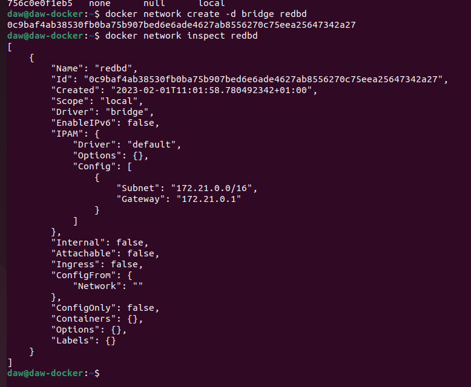

## 2. Crea un contenedor con una imagen de mariaDB que estará en la red redbd . Este contenedor se ejecutará en segundo plano, y será accesible a través del puerto 3306. (Es necesario definir la contraseña del usuario root y un volumen de datos persistente)

Creamos el volumen de datos

```
docker volume create volumenmariadb
```

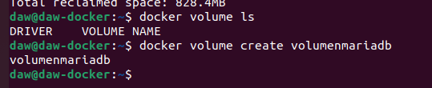

Creamos un contenedor de mariaDB con las especificaciones marcadas:

```
docker run -d --name mymaria --env MARIADB_ROOT_PASSWORD=laboral1 -v volumenmariadb:/var/run/mysqld --network redbd -p 3306:3306 mariadb:10.5
```

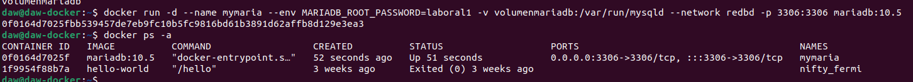

## 3. Crear un contenedor con Adminer que se pueda conectar al contenedor de la BD

Creamos el contenedos de admin con redbrige para que se pueda conectar a la BBDD despues de haber leido la [Documentacion de Adminer en Dockerhub](https://hub.docker.com/_/adminer/)

```
docker run --link mymaria:db -p 8080:8080 --network redbd  adminer
```
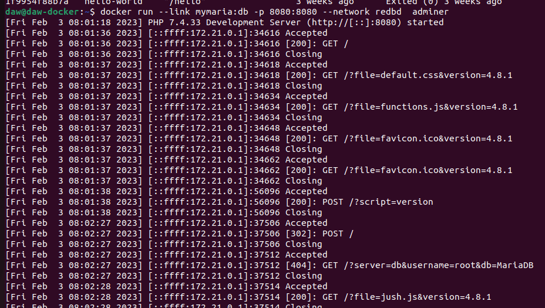


## 4. Comprobar que el contenedor Adminer puede conectar con el contenedor mysql abriendo un navegador web y accediendo a la URL: http://localhost:8080

Como vemos, desde el puerto 8080 podemos acceder a la aplicación Adminer
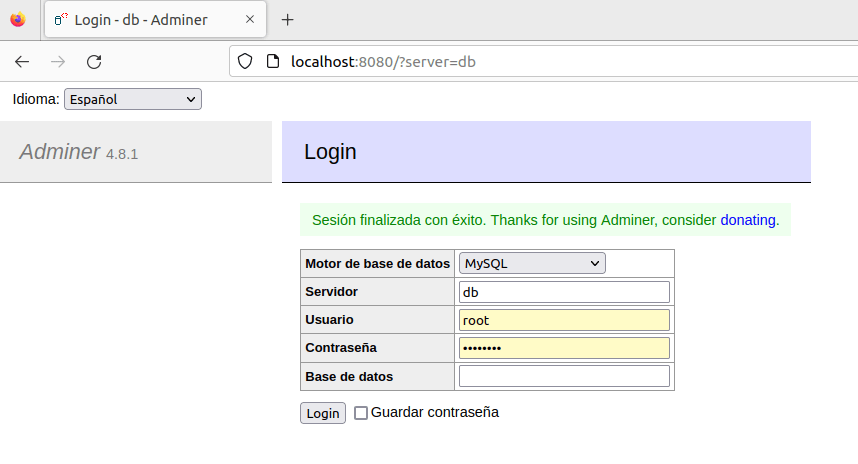


## Entregar los siguientes pantallazos y los comandos empleados para resolver cada apartado:
* Pantallazos donde se vean los contenedores creados y en ejecución

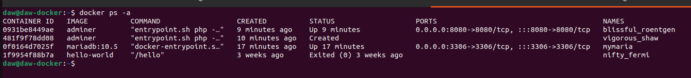

* Pantallazo donde se vea el acceso a la BD a través de la interfaz web de Adminer

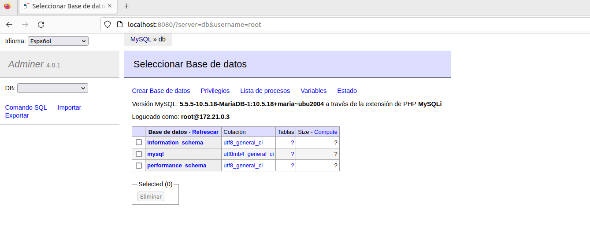

* Pantallazo donde se vea la creación de una BD con la interfaz web Adminer

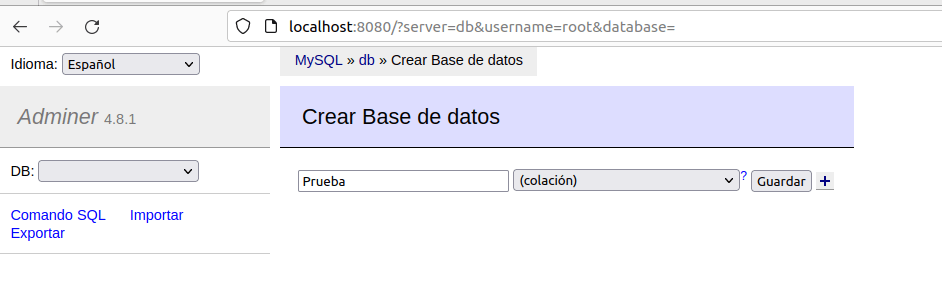
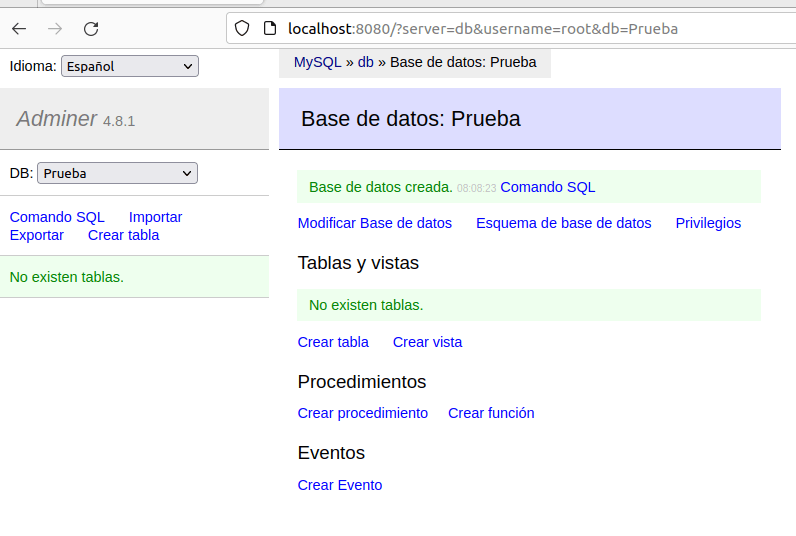

* Pantallazo donde se entre a la consola del servidor web en modo texto y se compruebe que se ha creado la BD

Entramos a mariadb por linea de comandos

```
docker exec -it mymaria mariadb --user root -plaboral1
```

Dentro ejecutamos el comando Show databases para ver todas las BBDD de MariaDB, vemos que estara la que hemos creado con Adminer
```
SHOW databases;


```
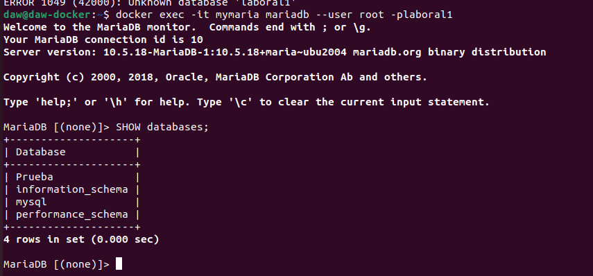

Borrar los contenedores la red y los volúmenes utilizados

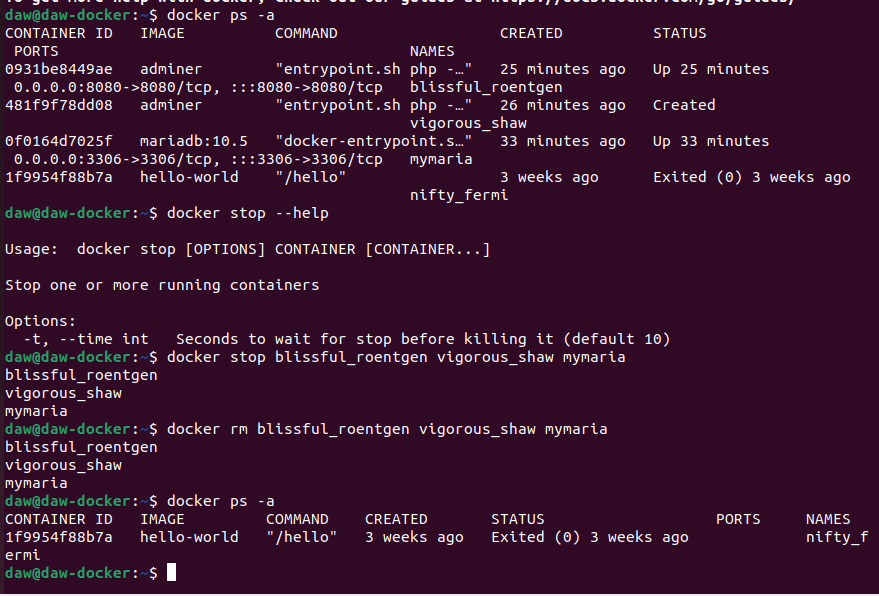