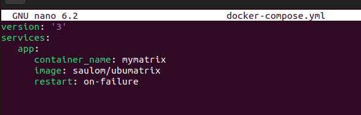

# Ejercicio 4 - Docker Compose
## Desplegar la aplicación cmatrix utilizando docker-compose.

Lo primero de todo, instalamos Docker Compose:

```
apt install docker-compose
```


Con un contenedor que hemos creado de prueba lo tratamos de subir a docker hub para trabajar con el en el compose

```
docker commit ubumatrix saulom/ubumatrix:version1
```


```
docker login

docker push saulom/ubumatrix:lastest

```


Con esto intentamos hacer un docker-compose.yml: (con fallidos resultados)



Tratamos de redactar un Dockerfile, pero como cmatrix requiere unos cuantos parametros de configuración la instalación falla


Para ver como hubiera sido una instalación correcta creamos un contenedor

```
docker run -d -it --name ubugreenrain ubuntu

docker exec -it ubugreenrain bash

apt-update

apt-get install cmatrix
```


Con esto el efecto cmatrix normal funcionaria, pero nosotros queremos además conseguir el efecto "greenrain"

Para ello debemos instalar unas dependencias

```
apt-get install git build-essential libncurses5-dev

```


Clonamos el github de greenrain

```
git clone https://github.com/aguegu/greenrain
```


Movemos los archivos a /usr/local/bin

```
mv /Descargas/greenrain/greenrain /usr/local/bin/
```


Para ejecutarlo simplemente ejecutaremos
```
greenrain
```

y para salir "q"
