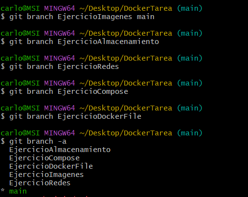
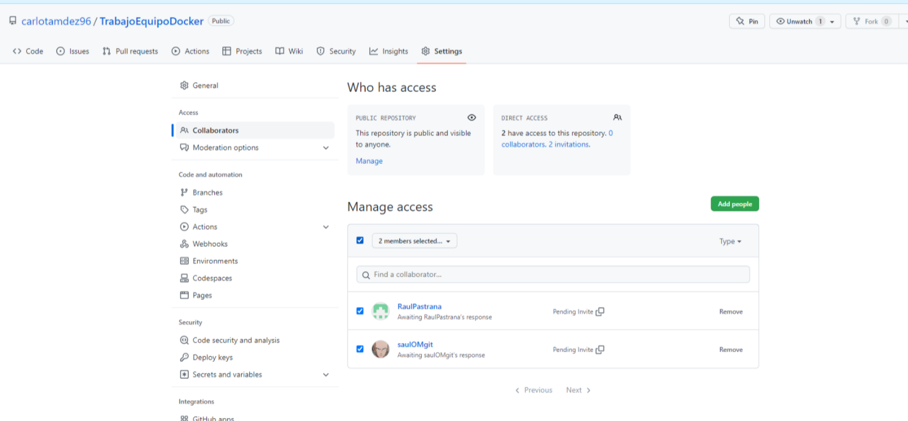
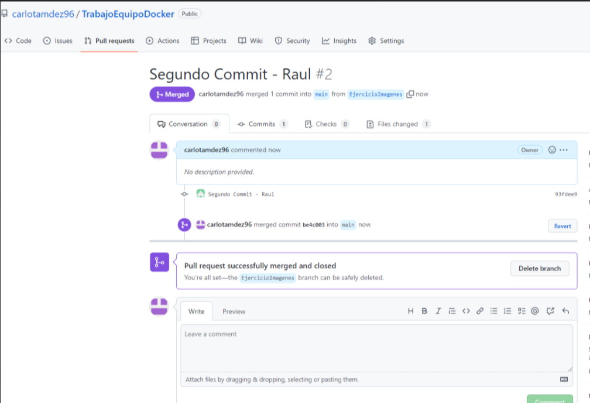

# Documentación 

El proyecto se creó el dia 1 de Febrero, en el cuál establecemos las tareas a realizar por cada uno de los miembros del equipo.

Tareas:

Trabajo con imagenes: Raul

Almacenamiento portainer: Raul

Redes: Saul

Docker compose: Saul

Imagenes con Dockerfile: Carlota

Las ramas se llamarán EjercicioImagenes, EjercicioRedes...

### Daily

Día 1/02: horas de 10:00-10:30

Lectura de las instrucciones del proyecto- global

Asignación de tareas globales para cada miembro del grupo.

Configuración en grupo del repositorio de git.

De 10:30 a 11:15, planificación individual del ejercicio, lectura del ejercicio y busqueda de la teoria como apoyo. Comienzo del ejercicio.

Creación de las Ramas:

Invitación desde GitHub a colaborar con Saul y Pastrana

Comprobación correcta de los pull request al crear las carpetas de los diferentes ejercicios

